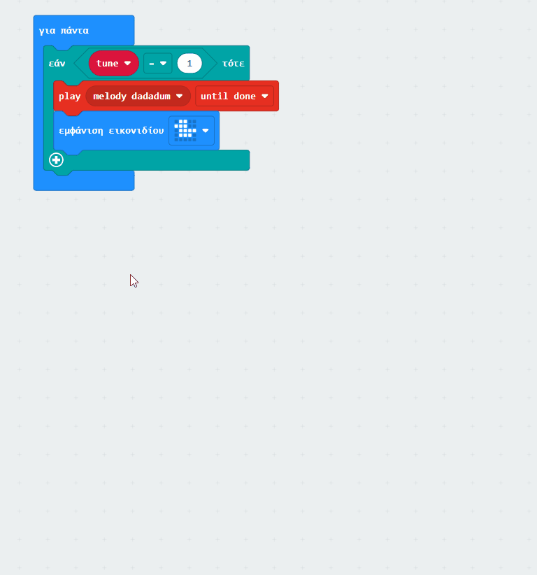

## Επίτρεψε στους χρήστες να κάνουν επιλογές

Μπορεί να υπάρχει μια κατάσταση όπου θέλεις ένας χρήστης να μπορεί να επιλέξει από ένα σύνολο επιλογών.

Για να γίνει αυτό, χρειάζεται να δημιουργήσεις μια μεταβλητή.

### Η μεταβλητή

Άνοιξε το μενού Μεταβλητές{:class="microbitvariables"} και κάνε κλικ στο κουμπί **Δημιουργία μεταβλητής**.

Δώσε στη μεταβλητή σου ένα όνομα **με νόημα**, που αντιπροσωπεύει την επιλογή που θα κάνει ο χρήστης.

Σύρε το μπλοκ `ορισμός`{:class='microbitvariables'} στο μπλοκ `κατά την έναρξη`{:class='microbitbasic'} και όρισε την τιμή της μεταβλητής σου σε `1`.

### Άλλαξε τη μεταβλητή

Στη συνέχεια, πρέπει να προσθέσεις κάποιες εισόδους που μπορεί να χρησιμοποιήσει ο χρήστης για να αλλάξει την τιμή στη μεταβλητή.

Μπορείς να χρησιμοποιήσεις κουμπιά ή χειρονομίες.

```microbit
let tune = 0
input.onButtonPressed(Button.A, function () {
    tune += -1
    if (tune < 1) {
        tune = 4
    }
})
input.onButtonPressed(Button.B, function () {
    tune += 1
    if (tune > 4) {
        tune = 1
    }
})
```

Χρειάζεται επίσης να βεβαιωθείς ότι η μεταβλητή δεν μπορεί να αποκτήσει τιμή μικρότερη από το "1" ή πάνω από τον αριθμό των επιλογών που έχεις. Στο παρακάτω παράδειγμα, υπάρχουν 4 επιλογές για μελωδίες.

### Άλλαξε την έξοδο με βάση τη μεταβλητή

Τώρα, το μόνο που σου μένει να κάνεις είναι να χρησιμοποιήσεις ένα μπλοκ `εάν`{:class='microbitlogic'} για να αλλάξεις το τι κάνει το micro:bit ανάλογα με την τιμή της μεταβλητής.

Άνοιξε το μενού `Λογική`{:class='microbitlogic'} και σύρε ένα μπλοκ `εάν`{:class='microbitlogic'} στον χώρο εργασίας.

Για να κάνεις επιλογές, χρειάζεσαι ένα `αλλιώς εάν`{:class='microbitlogic'} για κάθε επιλογή και δεν χρειάζεσαι το `αλλιώς`{:class='microbitlogic'} που συνοδεύεται αυτόματα με το μπλοκ `εάν`{:class='microbitlogic'}.

Κάνε κλικ στο σύμβολο "+" για να προσθέσεις όσα μπλοκ "αλλιώς εάν"{:class='microbitlogic'} χρειάζεσαι. Στη συνέχεια, κάνε κλικ στο σύμβολο `-` κάτω από το `αλλιώς`{:class='microbitlogic'} για να το αφαιρέσεις.



Χρησιμοποίησε τα μπλοκ "0 = 0"{:class='microbitlogic'} και το μπλοκ ονόματος μεταβλητής για να καθορίσεις τις απαντήσεις για κάθε μία από τις επιλογές "εάν"{:class='microbitlogic'} και "αλλιώς εάν"{:class=' microbitlogic'}.

```microbit
basic.forever(function () {
    let tune = 0
    if (tune == 1) {
        music._playDefaultBackground(music.builtInPlayableMelody(Melodies.Dadadadum), music.PlaybackMode.UntilDone)
        basic.showIcon(IconNames.Duck)
    } else if (tune == 2) {
        music._playDefaultBackground(music.builtInPlayableMelody(Melodies.Punchline), music.PlaybackMode.UntilDone)
    } else if (tune == 3) {
        music._playDefaultBackground(music.builtInPlayableMelody(Melodies.Birthday), music.PlaybackMode.UntilDone)
    } else if (tune == 4) {
        music._playDefaultBackground(music.builtInPlayableMelody(Melodies.Baddy), music.PlaybackMode.UntilDone)
    }
})
```
