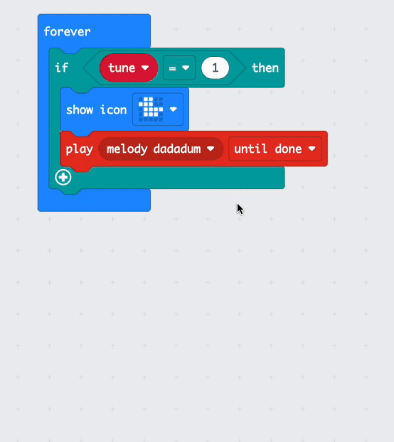

## Allow users to make choices

There might be a situation where you want a user to be able to choose from a set of options. 

To do this, you need to make a variable. 

### The variable

Open the `Variables`{:class='microbitvariables'} menu in your Toolbox, and click **Create a Variable**. 

Give your variable a **meaningful** name, one that represents the choice the user will make. 

Drag the `set`{:class='microbitvariables'} block into the `on start`{:class='microbitbasic'} block and set the value of your variable to `1`.

### Change the variable

Next, you need to add some inputs that the user can use to change the value in the variable.

You can use buttons or gestures. 

```microbit
let tune = 0
input.onButtonPressed(Button.A, function () {
    tune += -1
    if (tune < 1) {
        tune = 4
    }
})
input.onButtonPressed(Button.B, function () {
    tune += 1
    if (tune > 4) {
        tune = 1
    }
})
```

You also want to make sure the variable can't go below `1` or above the number of options you have. In the example above, there are 4 options for tunes.

### Change the output based on the variable

Now, all that is left for you to do is to use an `if`{:class='microbitlogic'} block to change what the micro:bit does depending on the value of the variable. 

Open the `Logic`{:class='microbitlogic'} menu and drag an `if`{:class='microbitlogic'} block into the workspace. 

To make choices, you need an `else if`{:class='microbitlogic'} for each option, and you don't want the `else`{:class='microbitlogic'} that automatically comes with the `if`{:class='microbitlogic'} block. 

Click the `+` symbol to add as many `else if`{:class='microbitlogic'} blocks as you need. Then click the `-` symbol under the `else`{:class='microbitlogic'} to remove it. 



Use the `0 = 0`{:class='microbitlogic'} blocks and the variable name block to set up responses for each of your `if`{:class='microbitlogic'} and `else if`{:class='microbitlogic'} options. 

```microbit
basic.forever(function () {
    let tune = 0
    if (tune == 1) {
        music._playDefaultBackground(music.builtInPlayableMelody(Melodies.Dadadadum), music.PlaybackMode.UntilDone)
        basic.showIcon(IconNames.Duck)
    } else if (tune == 2) {
        music._playDefaultBackground(music.builtInPlayableMelody(Melodies.Punchline), music.PlaybackMode.UntilDone)
    } else if (tune == 3) {
        music._playDefaultBackground(music.builtInPlayableMelody(Melodies.Birthday), music.PlaybackMode.UntilDone)
    } else if (tune == 4) {
        music._playDefaultBackground(music.builtInPlayableMelody(Melodies.Baddy), music.PlaybackMode.UntilDone)
    }
})
```
