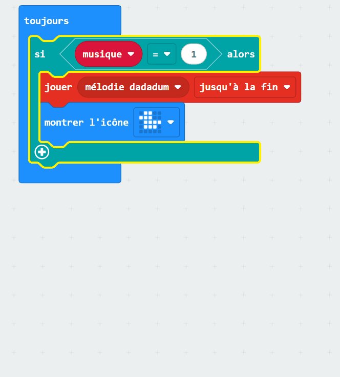

## Permettre aux utilisateurs de faire des choix

Il peut arriver que tu souhaites qu'un utilisateur puisse choisir parmi un ensemble d'options.

Pour cela, tu dois créer une variable.

### La variable

Ouvre le menu `Variables`{:class='microbitvariables'} dans ta boîte à outils et clique sur **Créer une variable**.

Donne à ta variable un nom **significatif**, qui représente le choix que l'utilisateur fera.

Fais glisser le bloc `définir`{:class='microbitvariables'} dans le bloc `au démarrage`{:class='microbitbasic'} et définis la valeur de ta variable sur `1`.

### Modifier la variable

Ensuite, tu dois ajouter des entrées que l'utilisateur peut utiliser pour modifier la valeur de la variable.

Tu peux utiliser des boutons ou des gestes.

```microbit
let musique = 0
input.onButtonPressed(Button.A, function () {
    musique += -1
    if (musique < 1) {
        musique = 4
    }
})
input.onButtonPressed(Button.B, function () {
    musique += 1
    if (musique > 4) {
        musique = 1
    }
})
```

Tu dois également t'assurer que la variable ne peut pas descendre en dessous de `1` ou au-dessus du nombre d'options dont tu disposes. Dans l'exemple ci-dessus, il y a 4 options pour les musiques.

### Modifier la sortie en fonction de la variable

Il ne te reste plus qu'à utiliser un bloc `si`{:class='microbitlogic'} pour modifier ce que fait le micro:bit en fonction de la valeur de la variable.

Ouvre le menu `Logique`{:class='microbitlogic'} et fais glisser un bloc `si`{:class='microbitlogic'} dans l'espace de travail.

Pour faire des choix, tu as besoin d'un `sinon si`{:class='microbitlogic'} pour chaque option, et tu ne souhaites pas du `sinon`{:class='microbitlogic'} qui vient automatiquement avec le bloc `si`{:class='microbitlogic'}.

Clique sur le symbole `+` pour ajouter autant de blocs `sinon si`{:class='microbitlogic'} que tu as besoin. Puis clique sur le symbole `-` sous le `sinon`{:class='microbitlogic'} pour le supprimer.



Utilise les blocs `0 = 0`{:class='microbitlogic'} et le bloc nom de la variable pour définir des réponses pour chacune de tes options `si`{:class='microbitlogic'} et `sinon si`{:class='microbitlogic'}.

```microbit
basic.forever(function () {
    let musique = 0
    if (musique == 1) {
        music._playDefaultBackground(music.builtInPlayableMelody(Melodies.Dadadadum), music.PlaybackMode.UntilDone)
        basic.showIcon(IconNames.Duck)
    } else if (musique == 2) {
        music._playDefaultBackground(music.builtInPlayableMelody(Melodies.Punchline), music.PlaybackMode.UntilDone)
    } else if (musique == 3) {
        music._playDefaultBackground(music.builtInPlayableMelody(Melodies.Birthday), music.PlaybackMode.UntilDone)
    } else if (musique == 4) {
        music._playDefaultBackground(music.builtInPlayableMelody(Melodies.Baddy), music.PlaybackMode.UntilDone)
    }
})
```
