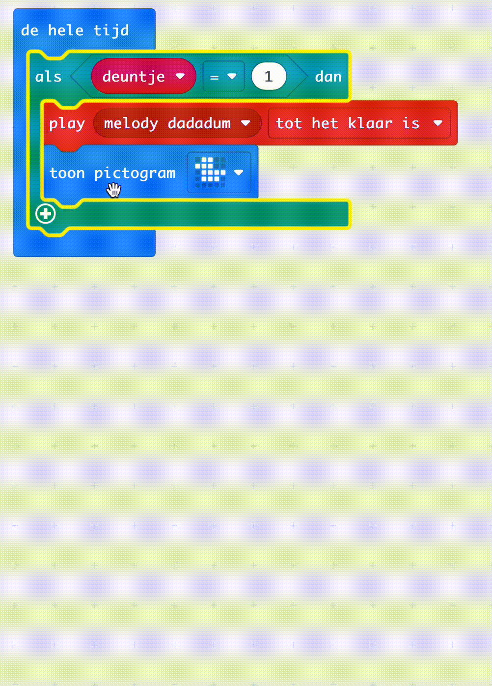

## Laat gebruikers keuzes maken

Er kan een situatie zijn waarbij je wilt dat een gebruiker kan kiezen uit een aantal opties.

Om dit te doen, moet je een variabele maken.

### De variabele

Open het Variabelen{:class='microbitvariables'} menu in je Toolbox en klik op **Maak een variabele**.

Geef je variabele een **betekenisvolle** naam, een naam die de keuze vertegenwoordigt die de gebruiker zal maken.

Sleep het `stel in op`{:class='microbitvariables'} blok naar het `bij opstarten`{:class='microbitbasic'} blok en stel de waarde van je variabele in op `1`.

### De variabele wijzigen

Vervolgens moet je enkele invoermogelijkheden toevoegen die de gebruiker kan gebruiken om de waarde in de variabele te wijzigen.

Je kunt knoppen of gebaren gebruiken.

```microbit
let deuntje = 0
input.onButtonPressed(Button.A, function () {
    deuntje += -1
    if (deuntje < 1) {
        deuntje = 4
    }
})
input.onButtonPressed(Button.B, function () {
    deuntje += 1
    if (deuntje > 4) {
        deuntje = 1
    }
})
```

Je wilt er ook voor zorgen dat de variabele niet onder `1` komt of boven het aantal opties dat je hebt. In het bovenstaande voorbeeld zijn er 4 opties voor deuntjes.

### Wijzig de uitvoer op basis van de variabele

Het enige wat je nu nog hoeft te doen is een `als`{:class='microbitlogic'} blok te gebruiken om te veranderen wat de micro:bit doet, afhankelijk van de waarde van de variabele.

Vanuit het `Logisch`{:class='microbitlogic'} menu, sleep een `als`{:class='microbitlogic'} blok naar het bewerkingspaneel.

Om keuzes te maken heb je een `anders als`{:class='microbitlogic'} nodig voor elke optie, en je wilt geen `anders`{:class='microbitlogic'} die automatisch meekomt met het `als`{:class='microbitlogic'} blok.

Klik op het `+` symbool om zoveel `anders als`{:class='microbitlogic'} blokken toe te voegen als je nodig hebt. Klik vervolgens op het `-` symbool onder `anders`{:class='microbitlogic'} om het te verwijderen.



Gebruik de `0 = 0`{:class='microbitlogic'} blokken en het variabele naamblok om antwoorden in te stellen voor elk van je `als`{:class='microbitlogic'} en `anders als`{:class='microbitlogic'} opties.

```microbit
basic.forever(function () {
    let deuntje = 0
    if (deuntje == 1) {
        music._playDefaultBackground(music.builtInPlayableMelody(Melodies.Dadadadum), music.PlaybackMode.UntilDone)
        basic.showIcon(IconNames.Duck)
    } else if (deuntje == 2) {
        music._playDefaultBackground(music.builtInPlayableMelody(Melodies.Punchline), music.PlaybackMode.UntilDone)
    } else if (deuntje == 3) {
        music._playDefaultBackground(music.builtInPlayableMelody(Melodies.Birthday), music.PlaybackMode.UntilDone)
    } else if (deuntje == 4) {
        music._playDefaultBackground(music.builtInPlayableMelody(Melodies.Baddy), music.PlaybackMode.UntilDone)
    }
})
```
